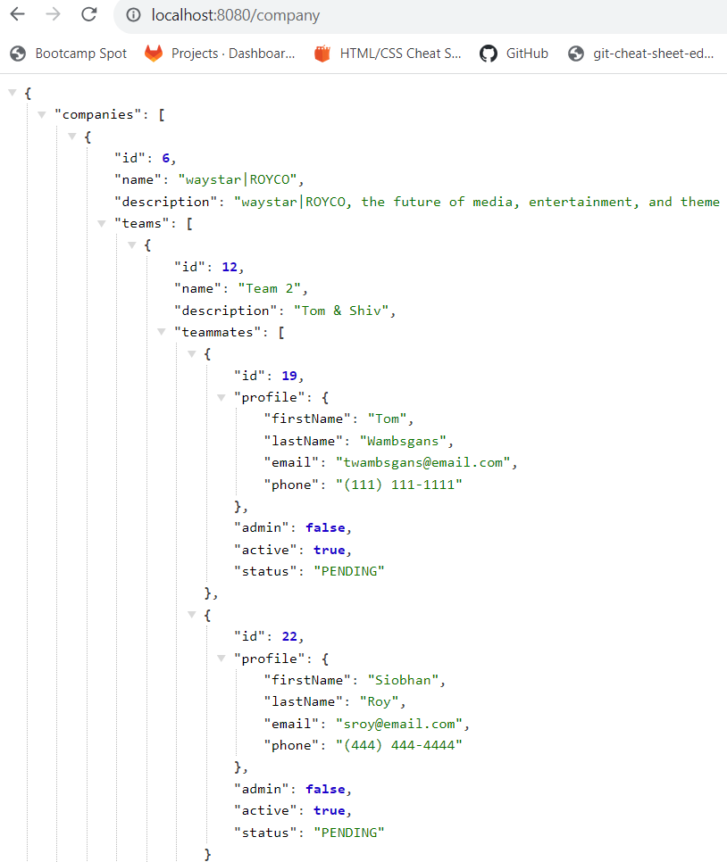

## Summary

I implemented the GET /company endpoint for the backend. This endpoint gets all of the
existing companies and all the data associated with those companies
## Checklist
- [x ] I tested the endpoint in postman to make sure the endpoint works.
- [x ] No error/warning in the console.

